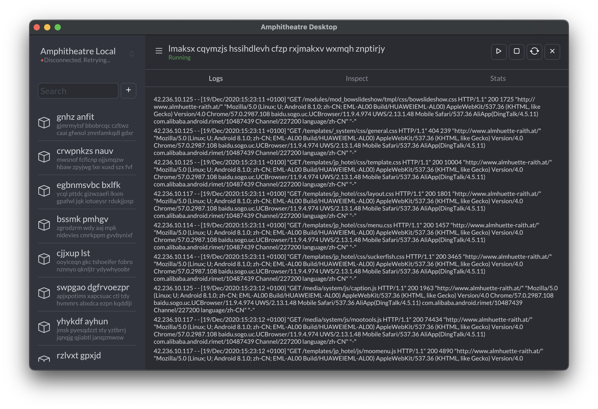

# Amphitheatre Desktop

Amphitheatre Desktop is an open source application that enables you to interact
with Amphitheatre using a GUI instead of the command line or a web browser.

 Amphitheatre Desktop encourages you and your team to collaborate using
best practices with Amphitheatre. You can use Amphitheatre Desktop to
facilitates continuous development of applications and microservices.
You can iterate your application source code locally, then deploy to a local
or remote Kubernetes cluster, just like docker build && kubectl apply or docker-compose up.

## Contributing

If anything feels off, or if you feel that some functionality is missing, please
check out the [contributing
page](https://docs.amphitheatre.app/contributing/). There you will find
instructions for sharing your feedback, building the tool locally, and
submitting pull requests to the project.

## License

Copyright (c) The Amphitheatre Authors. All rights reserved.

Licensed under the Apache License, Version 2.0 (the "License");
you may not use this file except in compliance with the License.
You may obtain a copy of the License at

      https://www.apache.org/licenses/LICENSE-2.0

Unless required by applicable law or agreed to in writing, software
distributed under the License is distributed on an "AS IS" BASIS,
WITHOUT WARRANTIES OR CONDITIONS OF ANY KIND, either express or implied.
See the License for the specific language governing permissions and
limitations under the License.
