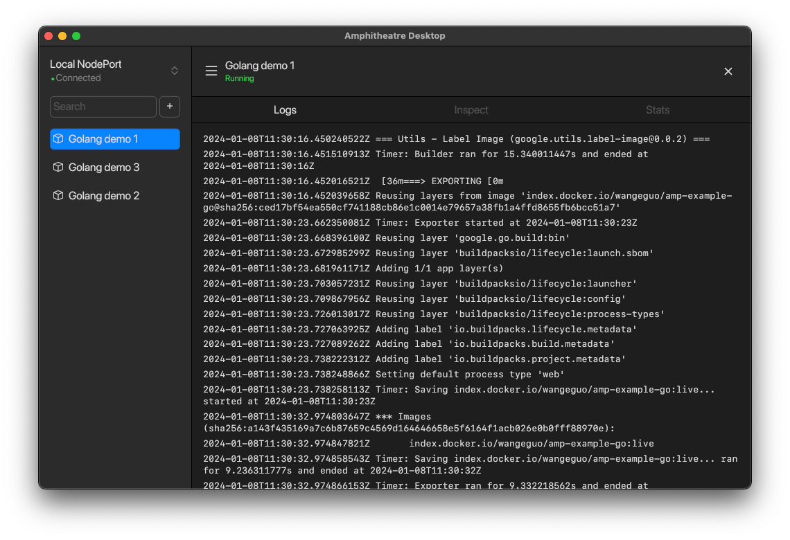

<div align="center">

# Amphitheatre Desktop


[](https://github.com/amphitheatre-app/desktop/blob/master/LICENSE)
[](https://github.com/amphitheatre-app/desktop/graphs/contributors)
[](https://github.com/amphitheatre-app/desktop/issues)
[](https://github.com/amphitheatre-app/desktop/releases/latest)

[Introduction](#introduction) •
[Features](#features) •
[Installation](#installation) •
[FAQ](#faq) •
[Contributing](#contributing)

</div>

## Introduction

Amphitheatre Desktop is an open source application that enables you to interact
with [Amphitheatre](https://amphitheatre.app/) using a GUI instead of the
command line or a web browser. You can use Amphitheatre Desktop to instantly
spin up fresh, automated dev environments in the cloud and start developing with
on-demand pre-configured tools, libraries, and dependencies.



## Features

- **No dependencies** No need to configure the local development environment and
  support for multiple programming languages and frameworks.

- **Unlimited isolation environments** Rapidly generate countless isolated
  integration test environments without any limitations, streamlining the test
  process and reducing costs.

- **Multi-component applications** Supports applications with multiple
  components, ideal for microservices-based applications and collaborative
  multi-person development.

- **Live Update** Lets you skip image builds altogether and update running
  containers with new code in seconds instead of minutes.

- **Integrations** Integrate development, testing, deployment, and other tools
  to create a comprehensive software integration solution, automating workflow
  processes to streamline software development.

- **Snapshots** Snapshots lets you share your dev environment and collaborate on
  issues as quickly as looking at the monitor next to you.

## Installation

Prebuilt binaries for macOS, Linux and Windows can be downloaded from the
[GitHub releases](https://github.com/amphitheatre-app/desktop/releases) page.
For everyone else, a detailed instruction can be found
[here](https://docs.amphitheatre.app/installation/desktop/). If there is no
distro package available for Amphitheatre Desktop in your preferred manager, you
need [Rust and cargo](https://www.rust-lang.org/tools/install) to build it.

### Install from source:

1. Clone the repository with `git clone https://github.com/amphitheatre-app/desktop.git`
2. From the `desktop` directory, run `cargo run --release` to build the
   application in release mode.
3. After a successful compilation, launch the executable with:
   `target/release/amphitheatre-desktop`.

### Install with cargo

```
cargo install --git https://github.com/amphitheatre-app/desktop
```

## FAQ

**_macOS won't let me open the app, what should I do?_**

Newer MacOS systems have security mechanisms that do not allow running unsigned
applications. Therefore, the first time you run it on MacOS, instead of
double-clicking, right-click and choose "Open". This will successfully open the
app.

**_What platforms are supported?_**

Amphitheatre Desktop can run on Windows, macOS and Linux on a great range of CPU
architectures. However, the x86_64 architecture is the main focus in
development. Official builds for the ARM64 architecture are also provided for
macOS and Linux. It is likely possible to compile the application on other
platforms as well.

In any case don't hesitate to [open an
issue](https://github.com/amphitheatre-app/desktop/issues), and I will do my
best to help you!

## Contributing

If anything feels off, or if you feel that some functionality is missing, please
check out the [contributing
page](https://docs.amphitheatre.app/contributing/). There you will find
instructions for sharing your feedback, building the tool locally, and
submitting pull requests to the project.

## License

Copyright (c) The Amphitheatre Authors. All rights reserved.

Licensed under the Apache License, Version 2.0 (the "License");
you may not use this file except in compliance with the License.
You may obtain a copy of the License at

      https://www.apache.org/licenses/LICENSE-2.0

Unless required by applicable law or agreed to in writing, software
distributed under the License is distributed on an "AS IS" BASIS,
WITHOUT WARRANTIES OR CONDITIONS OF ANY KIND, either express or implied.
See the License for the specific language governing permissions and
limitations under the License.
